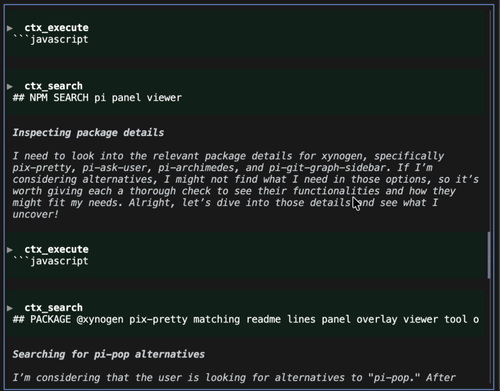

# pi-pop

> **Pop open a floating viewer to read [Pi](https://github.com/badlogic/pi)'s collapsible panels — without your scroll jumping around.**

Pi's conversation fills up with collapsible panels (tool calls, outputs, context). **pi-pop** gives you a pop-up viewer to read the full contents of any of them, right where you are. It shows a panel's expanded content **without actually expanding it**, so nothing in the conversation moves and your scroll position is never touched.



## Install

```bash
pi install npm:pi-pop
```

<sub>Or from git: `pi install git:github.com/ozancakir/pi-pop`</sub>

> Pi extensions run with full system access — review the source before installing. pi-pop ships no dependencies and no native code; it's a handful of small files under [`extensions/pi-pop/`](extensions/pi-pop).

## Use it

Press **Shift + Alt + any arrow** (or run **`/pop`**) to open the viewer. Inside:

| Key | Action |
|-----|--------|
| **← / →** | previous / next panel |
| **↑ / ↓** or **mouse wheel** | scroll the content |
| **Shift + ↑ / ↓** or **PgUp / PgDn** | jump a page |
| **Esc** | close |

Every collapsible panel also gets a dim `▶` / `▼` in the left margin so you can spot what's worth opening.

## Ask for a specific panel

Just tell Pi in plain language and it opens the viewer on the panel you mean — it calls the `pi-pop-show` tool for you:

- *"show the hypa result"* → opens the newest panel titled *hypa*
- *"show the last python3 output"* → opens it in the viewer

Because the agent opens it (no keypress), your scroll position is never touched. Or do it directly:

```
/pop hypa        # open the newest panel whose title matches "hypa"
```

## Choose which panels show up

By default the viewer lists panels that hide content. Change that just by asking Pi in plain language — it calls the `pi-pop-config` tool for you:

- *"show python3 outputs in the panel viewer"* → added
- *"stop showing grep results in panels"* → hidden

Or do it directly:

```
/pop-config show python3     # force-show panels whose title matches
/pop-config hide Grep        # hide matching panels
/pop-config remove python3   # drop a rule you added
/pop-config list             # show current rules
/pop-config reset            # clear
```

Rules are case-insensitive text or regex matched against a panel's first line, saved to `~/.pi/pi-pop.json`.

## Change the shortcut

Prefer a different key than Shift+Alt+Arrow? Set `keys` in `~/.pi/pi-pop.json` (any of Pi's key specs — restart Pi after editing):

```json
{ "keys": ["ctrl+p"] }
```

## Why a pop-up?

Pi renders into the **normal terminal buffer** (so scrollback, copy, and search keep working). The cost: re-drawing an off-screen panel snaps your view to the bottom. Toggling a panel in place — or any in-conversation navigation — hits that.

Without pi-pop, reading a long collapsed panel means scrolling around and getting yanked back to the bottom:


pi-pop sidesteps it entirely: it reads content into a floating overlay and **never mutates the conversation**, so there is nothing to snap. Works everywhere — any OS, and over SSH.

### Why not just click a panel to open it?

Because it can't be made reliable, for the same reason. To know *which* panel you clicked, the click has to be forwarded to the app — which means turning on terminal mouse reporting. But when the terminal forwards a click to the app while you're scrolled up, it first **snaps your viewport to the bottom** (that's the terminal's own behavior, before the app ever sees the event — there's no `preventDefault` in a terminal). So clicking a scrolled-up panel yanks you away from it.

The clicks that *don't* snap — plain click, Cmd-click, Shift-click — are the ones the terminal handles itself (native selection, opening links) and never sends to the app, so pi can't tell which panel they hit. Forwarded-and-snaps vs native-and-invisible: you can't have both.

This isn't Pi refusing the feature — it's a consequence of Pi rendering into the normal buffer on purpose (so your scrollback and copy keep working) rather than taking over the whole screen. The keyboard shortcut opens the viewer over *any* panel without a click, so nothing is lost.

## License

[MIT](LICENSE) © Ozan Cakir
